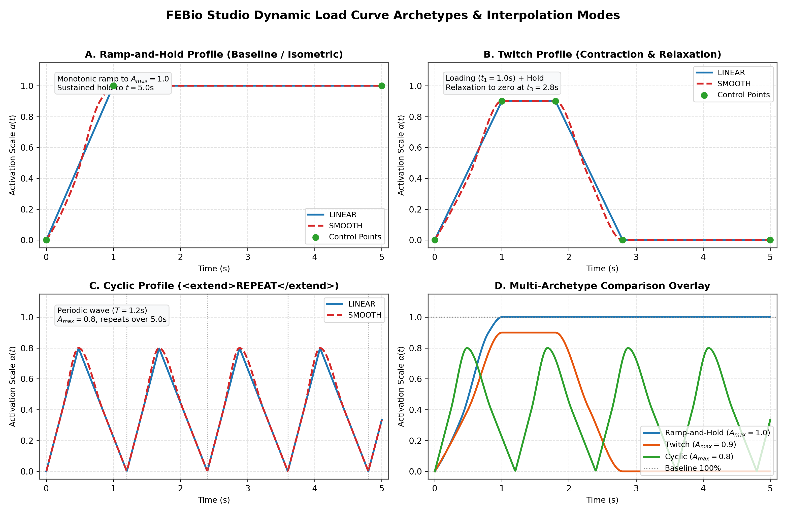

# FEBio Parametric Muscle Contraction Dataset Generation Pipeline

## 1. Project Overview

This repository contains an end-to-end framework for **generating, simulating, and extracting large-scale parametric datasets** of active skeletal muscle contractions in FEBio. The pipeline automates multi-dimensional parameter sampling (constitutive material properties, dynamic excitation waveforms, and in-situ prestretch), executes simulations headlessly via the FEBio command-line solver, and extracts sequential volumetric mesh exports (`.vtk`) into machine-learning-ready tabular time-series datasets (`.csv`) with comprehensive provenance metadata (`.json`).

---

## 2. Repository Structure

```text
data_pipeline/
├── ADDING_A_NEW_MUSCLE.md                 # Extension guide: Step-by-step tutorial for adding new geometries
├── data_pipeline_extraction.ipynb         # Interactive single-run baseline extraction notebook
├── ellipsoid-muscle-contraction.feb        # Baseline FEBio input model (ellipsoid geometry)
├── ellipsoid-muscle-contraction.fsm        # FEBio Studio model project
├── nodal_timeseries.csv                   # Baseline extracted nodal time-series (32,334 rows)
├── element_timeseries.csv                 # Baseline extracted element time-series (128,316 rows)
├── node_to_element_map.json               # Mesh topology mapping (node -> adjacent elements)
├── simulation_metadata.json               # Extracted material, solver, and load curve metadata
├── scripts/
│   └── data_extraction.py                # Standalone single-run extraction script
├── sample_ellipsoid_parametric_dataset/   # Batch generator: Idealized Ellipsoid (634 nodes)
│   ├── ellipsoid-muscle-contraction.feb   # Base simulation template (<plotfile type="vtk">)
│   ├── ellipsoid-muscle-prestretch.feb    # In-situ prestretch simulation template
│   ├── dataset_manifest.csv              # Summary table of all simulation runs
│   ├── dataset_manifest.json             # Provenance record (parameters, metrics, file paths)
│   ├── README.md                         # Usage guide for ellipsoid parametric sweeps
│   └── scripts/                          # config.py, generate_dataset.py, data_extraction.py
├── sample_biceps_parametric_dataset/      # Batch generator: Human Biceps (4,749 nodes)
│   ├── biceps-muscle-contraction.feb     # Standardized anatomical Biceps template
│   ├── dataset_manifest.csv              # Summary table of Biceps simulation runs
│   ├── dataset_manifest.json             # Provenance record for Biceps simulations
│   ├── README.md                         # Usage guide for Biceps parametric sweeps
│   └── scripts/                          # config.py, generate_dataset.py, data_extraction.py
├── sample_ta_parametric_dataset/          # Batch generator: Human Tibialis Anterior (44,684 nodes)
│   ├── ta-muscle-contraction.feb         # Standardized anatomical TA template
│   ├── dataset_manifest.csv              # Summary table of TA simulation runs
│   ├── dataset_manifest.json             # Provenance record for TA simulations
│   ├── README.md                         # Usage guide for TA parametric sweeps
│   └── scripts/                          # config.py, generate_dataset.py, data_extraction.py
├── vtk_files/                             # Baseline sequential timestep meshes (.0.vtk - .50.vtk)
└── jobs/                                  # Baseline solver logs and plotfile exports
```

---

## 3. Excitation & Load Curve Processing

The pipeline extracts and parametrizes time-varying active muscle excitation signals by parsing `<LoadData>` elements within the `.feb` file.



### Interpolation Methods
* **`LINEAR`**: Piecewise linear interpolation between discrete time-activation control points.
* **`SMOOTH`**: Natural cubic spline interpolation through control points, matching FEBio's smooth continuous acceleration and deceleration profiles.
* **Validation Checks**: If a `math` controller is detected, the parser issues a warning and returns a zero array to avoid silent extrapolation errors.

### Boundary Extension Rules
FEBio supports boundary behavior rules when simulation time exceeds the defined load curve endpoints. The parser uses NumPy and SciPy (`interp1d`) to evaluate these rules over the full simulation window:

* **`CONSTANT`**: Holds activation constant at the value of the nearest endpoint.
* **`EXTRAPOLATE`**: Extends the slope of the boundary segment linearly.
* **`REPEAT`**: Loops the control points periodically using cycle duration $T = t_{\max} - t_{\min}$.
* **`REPEAT OFFSET`**: Loops the cycle while accumulating offset gain from preceding cycles.

---

## 4. Field Processing & Tensor Flattening

* **Coordinate and Vector Fields**: Nodal positions $(X, Y, Z)$, displacements $(u_x, u_y, u_z)$, and reaction forces $(F_x, F_y, F_z)$ are unrolled into individual scalar columns (`*_0`, `*_1`, `*_2`).
* **Stress & Strain Tensors**: Second-order tensors (Cauchy stress $\boldsymbol{\sigma}$ and Green-Lagrange strain $\mathbf{E}$) are unrolled into 9 components (`*_0` through `*_8` in row-major order: $11, 12, 13, 21, 22, 23, 31, 32, 33$).
* **Fiber Metrics**: Fiber orientation unit vectors $(a_x, a_y, a_z)$ and local fiber stretch ratios ($\lambda = \|\mathbf{F} \cdot \mathbf{a}_0\|$) are extracted per element.

---

## 5. Dataset Specifications

### 5.1 Nodal Dataset (`nodal_timeseries.csv`)
* **Total Rows:** 32,334 (634 nodes $\times$ 51 timesteps)
* **Total Columns:** 12

| Column Name | Type | Description |
| :--- | :--- | :--- |
| `timestep` | Integer | Simulation time index ($0 \dots 50$) |
| `node_id` | Integer | Node identifier |
| `activation` | Float | Evaluated excitation signal $\alpha(t)$ |
| `coord_x`, `coord_y`, `coord_z` | Float | Reference Cartesian coordinates |
| `displacement_0`, `displacement_1`, `displacement_2` | Float | Displacement components $(u_x, u_y, u_z)$ |
| `reaction_forces_0`, `reaction_forces_1`, `reaction_forces_2` | Float | Reaction force components $(F_x, F_y, F_z)$ |

### 5.2 Element Dataset (`element_timeseries.csv`)
* **Total Rows:** 128,316 (2,516 elements $\times$ 51 timesteps)
* **Total Columns:** 27

| Column Name | Type | Description |
| :--- | :--- | :--- |
| `timestep` | Integer | Simulation time index ($0 \dots 50$) |
| `element_id` | Integer | Element identifier |
| `activation` | Float | Evaluated excitation signal $\alpha(t)$ |
| `stress_0` – `stress_8` | Float | Cauchy stress tensor components $\sigma_{ij}$ |
| `Lagrange_strain_0` – `Lagrange_strain_8` | Float | Green-Lagrange strain tensor components $E_{ij}$ |
| `relative_volume` | Float | Local volume ratio ($J = \det \mathbf{F}$) |
| `fiber_vector_0`, `fiber_vector_1`, `fiber_vector_2` | Float | Current fiber orientation unit vector |
| `fiber_stretch` | Float | Fiber stretch ratio $\lambda$ |

---

## 6. Metadata & Mesh Topology

* **`simulation_metadata.json`**:
  * **Material Model:** Transversely Isotropic Mooney-Rivlin parameters ($c_1, c_2, c_3, c_4, c_5, k, \lambda_{\max}$).
  * **Active Contraction:** Active tension and calcium dynamics parameters ($T_{\max}, ca_0, \beta, l_0, \text{refl}$). Parameters linked to load curves record `"driven_by_load_curve": "<id>"`.
  * **Control Settings:** Step count, step size, analysis mode (`DYNAMIC`), and convergence criteria.
  * **Load Curves:** Curve IDs, interpolation type, extension mode, control points, and driven parameter mappings.
* **`node_to_element_map.json`**: Maps each `node_id` to its adjacent element IDs for topological smoothing, vertex-centered aggregation, and Graph Neural Network (GNN) graph construction.

---

## 7. Interactive Single-Run Baseline & Validation

The pipeline runs in two distinct phases: **Simulation Execution (FEBio)** followed by **Data Extraction (Python/Notebook)**.

### Phase 1: Simulation Execution (FEBio)
1. **Model Configuration:** Ensure the `.feb` file specifies `<plotfile type="vtk">` under `<Output>`:
   ```xml
   <Output>
       <plotfile type="vtk">
           <var type="displacement"/>
           <var type="reaction forces"/>
           <var type="stress"/>
           <var type="Lagrange strain"/>
           <var type="relative volume"/>
           <var type="fiber vector"/>
           <var type="fiber stretch"/>
       </plotfile>
   </Output>
   ```
2. **Run Solver:** Execute the model using FEBioStudio or the command line:
   ```bash
   febio4 -i ellipsoid-muscle-contraction.feb
   ```
   This generates `.0.vtk` through `.50.vtk`. Place or point the output files to `vtk_files/`.
   
   > **Note:** A pre-computed baseline simulation (51 timesteps) is included in `vtk_files/` so the extraction pipeline can be verified immediately after cloning.

### Phase 2: Data Extraction & Preprocessing
1. **Install Dependencies:**
   ```bash
   pip install numpy pandas scipy pyvista jupyter
   ```
2. **Run Extraction Notebook:**
   * Open `data_pipeline_extraction.ipynb`.
   * Run all cells in order.
   * The notebook parses `<LoadData>`, reads sequential VTK files via PyVista, unrolls vector and tensor fields, and writes `nodal_timeseries.csv`, `element_timeseries.csv`, and `simulation_metadata.json`.
3. **Command-Line Alternative:**
   ```bash
   python scripts/data_extraction.py
   ```

---

## 8. Parametric Batch Generators (Multi-Geometry)

For parametric studies across constitutive parameters ($c_1, T_{\max}, ca_0$) and excitation dynamics, self-contained batch orchestrators are provided across three muscle geometries:

1. **Idealized Fusiform Ellipsoid:** [`sample_ellipsoid_parametric_dataset/`](sample_ellipsoid_parametric_dataset/README.md) (634 nodes, 2,516 elements; ~1.2s per run) — [Ellipsoid Guide](sample_ellipsoid_parametric_dataset/README.md)
2. **Anatomical Human Biceps Brachii:** [`sample_biceps_parametric_dataset/`](sample_biceps_parametric_dataset/README.md) (4,749 nodes, 15,857 elements; ~8s per run) — [Biceps Guide](sample_biceps_parametric_dataset/README.md)
3. **Anatomical Human Tibialis Anterior (TA):** [`sample_ta_parametric_dataset/`](sample_ta_parametric_dataset/README.md) (44,684 nodes, 196,999 elements; ~4.5 min per run) — [TA Guide](sample_ta_parametric_dataset/README.md)

### Flexible Sampling Modes & CLI Options
Each module's `scripts/config.py` and `scripts/generate_dataset.py` support three operational sampling modes:
* **Deterministic Grid Sweeps (`--mode grid`):** Cartesian product across discrete values or step-wise ranges. Includes a load curve toggle (`GRID_INCLUDE_LOAD_CURVE = False | True`) to choose between keeping excitation fixed at baseline or varying excitation systematically.
* **Monte Carlo Random Sampling (`--mode random`):** Uniform sampling within continuous parameter intervals with optional randomized dynamic waveforms (`ENABLE_VARYING_LOAD_CURVES`).
* **Explicit Custom Recipes (`--mode explicit_list`):** Iterates through predefined simulation dictionaries.
* **In-Situ Prestretch Toggle (`--prestretch` / `--no-prestretch`):** Dynamically enables resting fiber elongation via element-wise `<ElementData>` mapping with automatic template validation.

### Pre-Flight Verification & Safeguards
* **Pre-Flight Banner:** Confirms the active sampling mode, total planned runs, target simulation ID range, and parameter axes before solving.
* **Safe Run Thresholds:** Failsafe limits (`GRID_MAX_SIMS_SAFEGUARD`) prevent excessively large parameter grid sweeps from triggering long compute batches without confirmation (override with `--force`).
* **Dry-Run Inspection (`--dry-run`):** Displays a full preview table of the planned simulation queue, auto-resumed simulation IDs, and parameter values without executing the solver or modifying any files on disk.

```bash
# Example usage in any dataset module:
cd sample_ellipsoid_parametric_dataset

# Run active mode from config.py (auto-resumes from next available sim_XXX index)
python scripts/generate_dataset.py

# Preview execution plan without running
python scripts/generate_dataset.py --dry-run

# Run deterministic grid sweep
python scripts/generate_dataset.py --mode grid

# Run Monte Carlo random batch of 5 runs
python scripts/generate_dataset.py --mode random --num-sims 5

# Run Monte Carlo random batch with in-situ prestretch
python scripts/generate_dataset.py --mode random --num-sims 5 --prestretch
```

---

## 9. Extending the Pipeline: Adding New Muscle Geometries

The data generation pipeline is strictly geometry-agnostic and modular. To integrate a new anatomical muscle geometry (e.g. *Gastrocnemius*, *Soleus*, *Rectus Femoris*):

1. **Prepare Template in FEBio Studio**: Export a verified `.feb` file with `DYNAMIC` 50-step analysis and `<plotfile type="vtk">`. (Optionally configure `uncoupled prestrain elastic` if in-situ prestretch is desired).
2. **Duplicate Module Folder**: Copy `sample_biceps_parametric_dataset/` to `sample_<new_muscle>_parametric_dataset/`.
3. **Configure Bounds**: In `scripts/config.py`, point to the new `.feb` file and define muscle-specific physiological parameter ranges.
4. **Generate**: Run `python scripts/generate_dataset.py --mode random --num-sims 20`.

**Extension Guide:** For detailed XML specifications, in-situ prestretch setup, and module customization, refer to [`ADDING_A_NEW_MUSCLE.md`](./ADDING_A_NEW_MUSCLE.md).
